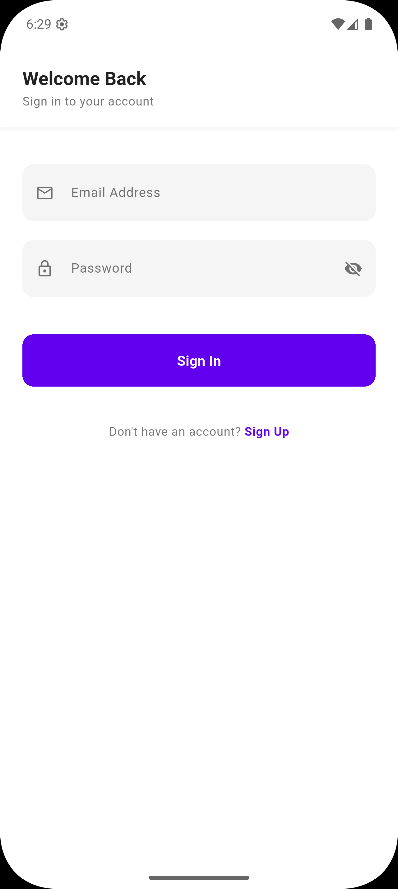
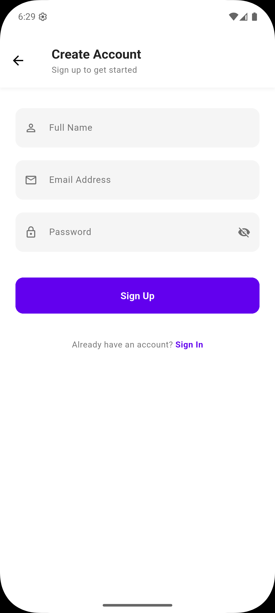
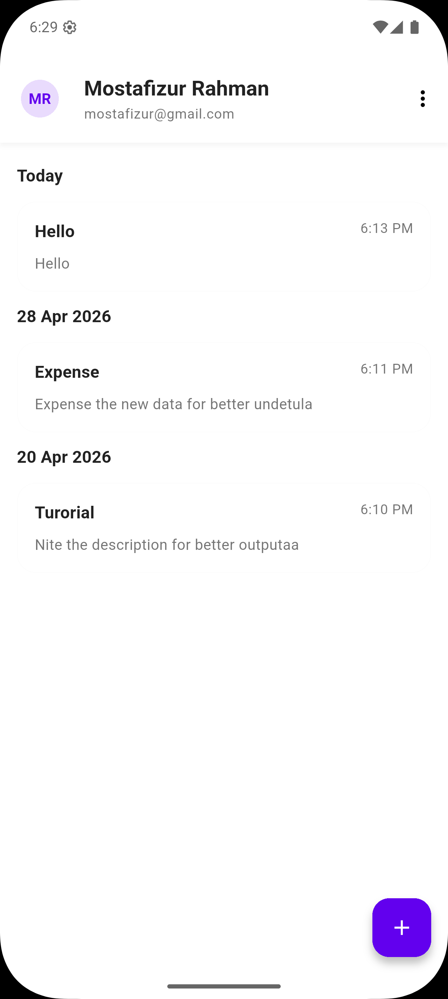

# Note Tracker

A Flutter note-taking app built with Firebase, GetX, and `go_router`.

The app lets a user sign up, sign in, stay logged in across launches, and create personal notes that are stored in Cloud Firestore. Notes are grouped by date and shown in descending order so the latest entries appear first.


## Screenshots

### Splash / Auth



### Sign Up



### Dashboard




## Features

- Email/password-style sign up and sign in flow
- Session persistence with `SharedPreferences`
- Splash screen with login-state check
- Personal dashboard for the logged-in user
- Add note bottom sheet
- Notes stored in Cloud Firestore
- Notes grouped by day such as `Today` and `Yesterday`
- Latest notes shown first based on `createdAt`
- Logout flow

## Tech Stack

- Flutter
- Dart
- Firebase Core
- Cloud Firestore
- GetX for dependency injection and controller state
- `go_router` for app navigation
- `SharedPreferences` for local session state

## Project Structure

```text
lib/
├── common/
│   ├── binding/
│   └── widgets/
├── presentation/
│   ├── auth/
│   ├── dashboard/
│   └── splash/
├── routes/
├── utils/
└── main.dart
```

## Screens

- `SplashScreen`: checks whether the user is already logged in
- `SignInScreen`: allows existing users to sign in
- `SignUpScreen`: creates a new user account
- `DashboardScreen`: lists notes and allows creating a new note


## Navigation

Navigation is managed with `go_router`.

Routes currently used in the app:

- `/` -> splash
- `/sign-in` -> sign in
- `/sign-up` -> sign up
- `/dashboard` -> dashboard

## Data Storage

The app uses Firestore with the following collections:

- Users collection: `users-note-tracker`
- Notes subcollection: `note-tracker`

Each user document is stored by email, and that user’s notes are stored inside the notes subcollection under the same document.

## State Management

GetX is used for:

- dependency binding
- controller lifecycle
- UI updates through `GetBuilder`

## Setup

### 1. Prerequisites

Make sure you have:

- Flutter SDK installed
- A Firebase project configured
- Android Studio, VS Code, or another Flutter-compatible IDE

### 2. Install dependencies

```bash
flutter pub get
```

### 3. Configure Firebase

This project expects Firebase to be connected already.

Check that the platform-specific Firebase files are available, especially:

- `android/app/google-services.json`
- iOS/macOS Firebase setup if you plan to run on Apple platforms

Also make sure Firestore is enabled in your Firebase project.

### 4. Run the app

```bash
flutter run
```

## How It Works

1. The app opens on the splash screen.
2. Splash reads the saved login flag from `SharedPreferences`.
3. Logged-in users go to the dashboard.
4. Logged-out users go to sign in.
5. After sign in or sign up, the app saves login state locally.
6. Notes are streamed from Firestore and rendered on the dashboard.
7. New notes are saved with a server timestamp and shown first in the list.

## Main Dependencies

- `firebase_core`
- `cloud_firestore`
- `get`
- `go_router`
- `shared_preferences`

## Development Notes

- Firebase initialization is handled in `main.dart`
- Initial dependencies are registered through `InitialBinding`
- Snackbars are shown through a shared `ScaffoldMessenger`
- Dashboard notes are sorted by `createdAt` in descending order for display

## Important Note

This project uses a custom Firestore-based sign-in flow for demo/task purposes. It is not a replacement for production-ready authentication. For a real app, use Firebase Authentication and secure password handling.

## License

This project is for learning or assignment/demo use unless you choose to add a separate license.
